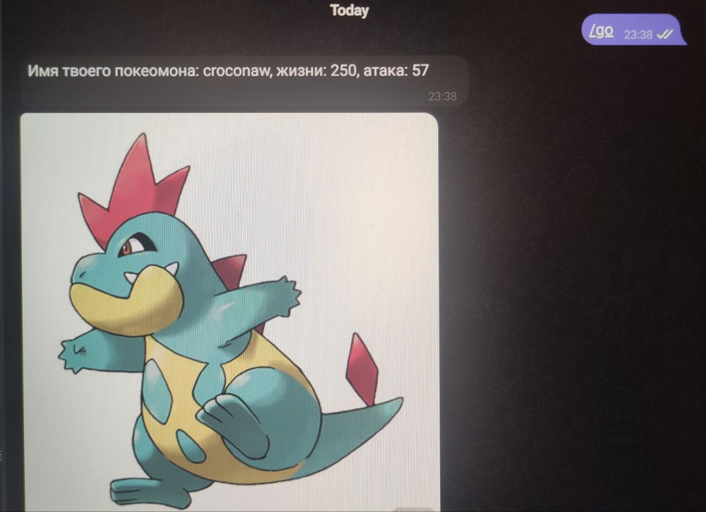
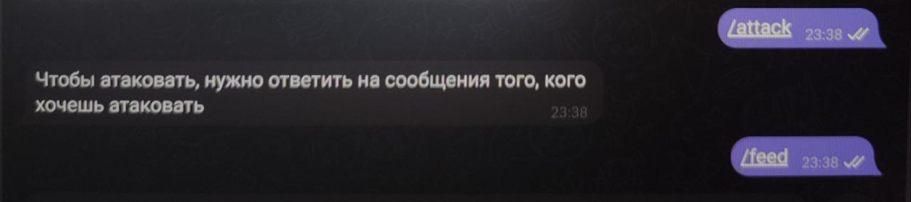

<a id = "start"></a>
# Телеграм-бот
## "Игра в покемонов"
---
---
### Описательная информация:
- ___Данный проект представляет из себя телеграм-бот, который является в свою очередь игрой в покемонов.___
- _Взаимодействия в игре происходят засчёт команд:_
    - `/go` - запуск бота и начало игры, создание покемона с определёнными характеристиками (покемон и его характеристики присваиваются игроку методом рандома).
    ```
    @bot.message_handler(commands=['go'])
    def start (message):
        if message.from_user.username not in    Pokemon.pokemons.keys():
            chance = randint(1,3)
            if chance == 1:
                pokemon = Pokemon(message.from_user.username)
            elif chance == 2:
                pokemon = Wizard(message.from_user.username)
            elif chance == 3:
                pokemon = Fighter(message.from_user.username)
            bot.send_message(message.chat.id, pokemon.info())
            bot.send_photo(message.chat.id, pokemon.show_img())
        else:
            bot.reply_to(message, "Ты уже создал себе покемона")
    ```
    - `/attack` - команда, позволяющая атаковать другого игрока.
    ```
    @bot.message_handler(commands=['attack'])
    def attack_pok(message):
        if message.reply_to_message:
            if message.reply_to_message.    from_user.username in Pokemon.pokemons.keys() and message.from_user.username in Pokemon.pokemons.keys():
                enemy = Pokemon.pokemons[message.reply_to_message.from_user.username]
                pok = Pokemon.pokemons[message.from_user.username]
                res = pok.attack(enemy)
                bot.send_message(message.chat.id, res)
            else:
                bot.send_message(message.chat.id, "Сражаться можно только с покемонами")
        else:
            bot.send_message(message.chat.id, "Чтобы атаковать, нужно ответить на сообщения того, кого хочешь атаковать")     
    ```
    - `/feed` - команда, которая представляет из себя действие кормления собственного покемона для того, чтобы восстановить его здоровье.
    ```
    @bot.message_handler(commands=['feed'])
    def feed(message):
        if message.from_user.username in Pokemon.pokemons.keys():
            pok = Pokemon.pokemons[message.from_user.username]
            bot.send_message(message, pok.feed())

    ```
- _Игра имеет некоторые особенности. Например, игроку может выпасть покемон класса Wizard - волшебник, или Fighter - боец. Они имеют некоторые отличия. Это можно заметить, просмотрев код:_
    - У `Wizard`:
    ```
    class Wizard(Pokemon):
        def feed(self):
            return super().feed(feed_interval=30)
    ```
    - У `Fighter`, который, в отличие от Wizard, имеет более сложную и эффективную атаку, а также увеличение здоровья при кормлении на 20 единиц (вместо 10), но при этом имеет больший интервал времени кормления (в два раза - 60 вместо 30 у Wizard):
    ```
    class Fighter(Pokemon):
        def attack(self, enemy):
            super_power = randint(5,15)
            self.power += super_power
            result = super().attack(enemy)
            self.power -= super_power
            return result + f"\n Боец применил супер-атаку силой:{super_power} "
    
        def feed(self):
            return super().feed(hp_increase=20)
    ```
---
### Принцип работы в Telegram
---
>_Пример работы команды `/go`:_



>_Примеры работы команд `/attack` и `/feed`_ (функция `/attack` будет доступна при игре с другим игроком; на данный момент функция `/feed` находится в дальнейшей разработке):



---
[Вернуться к началу]("start")